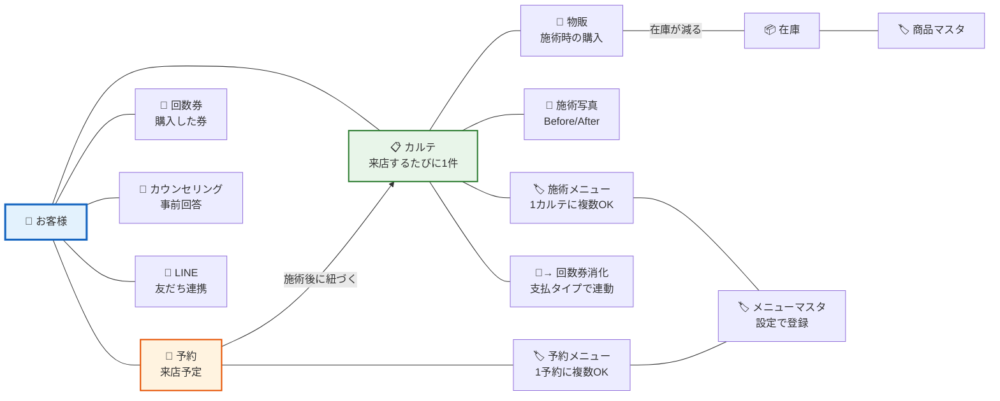

# salon-karte ユーザーフロー図

> 更新日: 2026-03-24
> 目的: サロンオーナーの視点で「何をするには何が必要か」「データがどこで生まれてどこで見られるか」を可視化する

---

## 1. 画面遷移図（Screen Transition Map）

サロンオーナーが触る全画面とその遷移関係。

```mermaid
flowchart TB
    subgraph 初回のみ
        LP[トップページ LP] --> SIGNUP[サインアップ]
        SIGNUP --> EMAIL_CONFIRM[メール認証]
        EMAIL_CONFIRM --> SETUP[初期セットアップ<br/>サロン名・電話・住所・営業時間]
    end

    SETUP --> DASH

    subgraph メインナビゲーション
        DASH[ダッシュボード<br/>📊 今日の予約・KPI・誕生日・離脱警告]
        CUST_LIST[顧客一覧]
        REC_LIST[カルテ一覧]
        APT_LIST[予約カレンダー]
        SALES[売上・分析]
        SETTINGS[設定]
    end

    DASH --> CUST_LIST
    DASH --> REC_LIST
    DASH --> APT_LIST
    DASH --> SALES
    DASH --> SETTINGS

    subgraph 顧客管理
        CUST_LIST --> CUST_NEW[顧客を登録]
        CUST_LIST --> CUST_DETAIL[顧客詳細<br/>基本情報・来店分析・売上]
        CUST_DETAIL --> CUST_EDIT[顧客を編集]
        CUST_DETAIL --> PURCHASE_NEW[物販を登録]
        CUST_DETAIL --> TICKET_NEW[回数券を登録]
        CUST_DETAIL --> REC_DETAIL
        CUST_DETAIL --> APT_DETAIL
    end

    subgraph カルテ管理
        REC_LIST --> REC_NEW[カルテを作成<br/>メニュー・写真・物販・回数券]
        REC_LIST --> REC_DETAIL[カルテ詳細<br/>施術内容・写真・メモ]
        REC_DETAIL --> REC_EDIT[カルテを編集]
        REC_DETAIL --> REC_PRINT[印刷用カルテ]
    end

    subgraph 予約管理
        APT_LIST --> APT_NEW[予約を登録<br/>顧客・メニュー・日時・スタッフ]
        APT_LIST --> APT_DETAIL[予約詳細<br/>前回カルテ・カウンセリング]
        APT_DETAIL --> APT_EDIT[予約を編集]
        APT_DETAIL --> REC_NEW
    end

    subgraph 売上・分析
        SALES --> SALES_DAILY[日別売上帳]
        SALES --> SALES_ANALYTICS[分析<br/>LTV・リピート率・ランキング]
        SALES --> INV_DASH[在庫管理]
        INV_DASH --> INV_PRODUCTS[商品マスタ]
        INV_DASH --> INV_RECEIVE[入庫]
        INV_DASH --> INV_CONSUME[出庫]
        INV_DASH --> INV_STOCKTAKE[棚卸し]
        INV_DASH --> INV_TAX[確定申告レポート]
    end

    subgraph 設定
        SETTINGS --> SET_HOURS[営業時間]
        SETTINGS --> SET_HOLIDAYS[臨時休業・時間変更]
        SETTINGS --> SET_MENUS[メニュー管理]
        SETTINGS --> SET_BOOKING_RULES[予約受付ルール]
        SETTINGS --> SET_WEB_BOOKING[Web予約ページ]
        SETTINGS --> SET_COUNSELING[カウンセリングシート]
        SETTINGS --> SET_LINE[LINE連携]
        SETTINGS --> SET_STAFF[スタッフ管理]
        SETTINGS --> SET_SHIFTS[シフト管理]
        SETTINGS --> SET_IMPORT[データ取込]
        SETTINGS --> SET_EXPORT[データ出力]
        SETTINGS --> SET_BILLING[プラン・お支払い]
    end

    subgraph お客様が触る画面（公開）
        WEB_BOOK[Web予約ページ<br/>メニュー選択→日時選択→確認]
        WEB_BOOK --> WEB_BOOK_DONE[予約完了]
        WEB_BOOK_CANCEL[予約キャンセル<br/>トークンURLから]
        WEB_BOOK_CHANGE[予約変更<br/>トークンURLから]
        COUNSELING[カウンセリング回答<br/>トークンURLから]
        COUNSELING --> COUNSELING_DONE[回答完了]
    end

    SET_WEB_BOOKING -.->|URLを発行| WEB_BOOK
    APT_DETAIL -.->|URLを送信| COUNSELING

    style DASH fill:#E8F5E9,stroke:#4CAF50,stroke-width:2px
    style SETUP fill:#FFF3E0,stroke:#FF9800,stroke-width:2px
    style SETTINGS fill:#E3F2FD,stroke:#2196F3,stroke-width:2px
    style WEB_BOOK fill:#FCE4EC,stroke:#E91E63,stroke-width:2px
    style COUNSELING fill:#FCE4EC,stroke:#E91E63,stroke-width:2px
```

---

## 2. 業務フロー図（Business Flow）

サロンオーナーの1日の業務と、salon-karteの各機能がどの場面で使われるか。

```mermaid
flowchart TD
    subgraph 開業準備（初回のみ）
        S1[1. サインアップ] --> S2[2. 初期セットアップ<br/>サロン名・営業時間]
        S2 --> S3[3. メニューを登録<br/>⚠️ 予約・カルテに必須]
        S3 --> S4{商品を扱う？}
        S4 -->|はい| S5[4. 商品マスタ登録<br/>在庫管理に必須]
        S4 -->|いいえ| S6[5. Web予約を有効化<br/>URLを発行]
        S5 --> S6
        S6 --> S7{LINE通知を使う？}
        S7 -->|はい| S8[6. LINE連携設定<br/>チャネル情報を入力]
        S7 -->|いいえ| S9[7. カウンセリングシート<br/>テンプレートをカスタマイズ]
        S8 --> S9
        S9 --> READY[✅ 準備完了]
    end

    subgraph 来店前
        B1[お客様がWeb予約] --> B2{新規？}
        B2 -->|新規| B3[カウンセリングURLを送信]
        B3 --> B4[お客様が事前回答]
        B2 -->|既存| B5[予約確認通知<br/>LINE or メール]
        B4 --> B6[前日リマインド<br/>LINE自動送信]
        B5 --> B6
    end

    subgraph 来店当日
        C1[ダッシュボードで<br/>今日の予約を確認] --> C2[前回のカルテ・<br/>カウンセリング回答を確認]
        C2 --> C3[施術を実施]
        C3 --> C4[カルテを作成<br/>メニュー・写真・メモ]
        C4 --> C5{物販あり？}
        C5 -->|はい| C6[物販を記録<br/>在庫自動減算]
        C5 -->|いいえ| C7{回数券？}
        C6 --> C7
        C7 -->|販売| C8[回数券を発行]
        C7 -->|消化| C9[回数券を消化<br/>支払タイプ=ticket]
        C7 -->|なし| C10[会計・お見送り]
        C8 --> C10
        C9 --> C10
    end

    subgraph 営業後・月次
        D1[日別売上帳で<br/>今日の売上を確認] --> D2[月次売上サマリー]
        D2 --> D3[分析ダッシュボード<br/>LTV・リピート率]
        D3 --> D4{在庫管理}
        D4 --> D5[発注点アラート確認]
        D5 --> D6[入庫を記録]
        D4 --> D7[棚卸し<br/>実数とシステムを照合]
    end

    subgraph 年次
        E1[確定申告レポート<br/>売上・仕入・原価] --> E2[CSVエクスポート<br/>→ freee等に取込]
    end

    READY --> B1
    READY --> C1
    C10 --> D1
    D2 --> E1

    style READY fill:#E8F5E9,stroke:#4CAF50,stroke-width:3px
    style S3 fill:#FFF9C4,stroke:#FFC107,stroke-width:2px
    style S6 fill:#FFF9C4,stroke:#FFC107,stroke-width:2px
    style C4 fill:#E8F5E9,stroke:#4CAF50,stroke-width:2px
```

### 設定の依存関係（何をするには何が必要か）

```mermaid
flowchart LR
    subgraph 必須設定（これがないと始まらない）
        SALON[サロン情報<br/>名前・営業時間]
        MENU[メニュー登録<br/>名前・時間・料金]
    end

    subgraph 機能別の前提設定
        HOURS[営業時間] -->|予約の空き枠計算に必要| BOOKING_RULES[予約受付ルール]
        BOOKING_RULES --> WEB_BOOKING[Web予約ページ<br/>URL発行]
        MENU -->|予約時のメニュー選択| WEB_BOOKING
        MENU -->|カルテ作成時のメニュー選択| RECORD[カルテ作成]

        PRODUCT[商品マスタ] -->|物販記録時の商品選択| PURCHASE[物販記録]
        PRODUCT -->|在庫の入出庫管理| INVENTORY[在庫管理]

        COUNSELING_TPL[カウンセリング<br/>テンプレート] -->|回答フォームの質問内容| COUNSELING[カウンセリング送信]

        LINE_CONFIG[LINE連携設定] -->|通知の送信先| LINE_NOTIFY[LINE通知<br/>予約確認・リマインド]

        STAFF[スタッフ登録] -->|担当者の指名| APPOINTMENT[予約の担当指定]
        STAFF -->|シフトで空き枠制御| SHIFTS[シフト管理]
        SHIFTS -->|スタッフ別の空き枠| WEB_BOOKING
    end

    SALON --> HOURS
    SALON --> MENU

    style SALON fill:#FFCDD2,stroke:#E53935,stroke-width:2px
    style MENU fill:#FFCDD2,stroke:#E53935,stroke-width:2px
    style WEB_BOOKING fill:#C8E6C9,stroke:#43A047
    style RECORD fill:#C8E6C9,stroke:#43A047
```

---

## 3. データフロー図（ユーザー目線）

DB の英語カラム名ではなく、「どの操作で何のデータが生まれ、どこで見られるか」をユーザー目線で整理。

```mermaid
flowchart TD
    subgraph 入力（データが生まれる場面）
        I1[👤 顧客を登録<br/>名前・連絡先・肌質・アレルギー]
        I2[📋 カルテを作成<br/>施術メニュー・肌状態・メモ・写真]
        I3[📅 予約を登録<br/>日時・メニュー・担当スタッフ]
        I4[🛒 物販を記録<br/>商品・数量・金額]
        I5[🎫 回数券を発行<br/>券名・回数・金額・有効期限]
        I6[📝 カウンセリング回答<br/>お客様が自分で入力]
        I7[📦 入庫を記録<br/>商品・数量・仕入単価]
        I8[🌐 Web予約<br/>お客様が自分で予約]
    end

    subgraph 蓄積（データの状態変化）
        direction TB
        A1[顧客データ<br/>来店回数が増える<br/>最終来店日が更新される]
        A2[カルテ履歴<br/>施術ごとに1件ずつ蓄積<br/>写真が紐づく]
        A3[予約<br/>未確認→確認済→完了<br/>カルテと紐づく]
        A4[物販履歴<br/>カルテに紐づいて蓄積<br/>在庫が自動で減る]
        A5[回数券<br/>発行→消化中→消化済み<br/>カルテで1回ずつ消化]
        A6[在庫<br/>入庫で増える・物販で減る<br/>棚卸しで補正]
    end

    I1 --> A1
    I2 --> A2
    I3 --> A3
    I4 --> A4
    I5 --> A5
    I6 -->|回答が顧客に紐づく| A1
    I7 --> A6
    I8 --> A3

    subgraph 閲覧（データが見られる場所）
        direction TB
        V1[🏠 ダッシュボード<br/>・今日の予約<br/>・月間売上/来店数<br/>・誕生日のお客様<br/>・離脱警告（60日以上未来店）<br/>・在庫アラート]
        V2[👤 顧客詳細<br/>・基本情報<br/>・来店回数・最終来店<br/>・施術カルテ一覧<br/>・物販履歴<br/>・回数券の残数<br/>・カウンセリング回答<br/>・累計売上]
        V3[📋 カルテ詳細<br/>・施術メニューと金額<br/>・Before/After写真<br/>・肌状態メモ<br/>・次回来店メモ<br/>・会話メモ]
        V4[💰 月次売上<br/>・施術売上（現金/カード別）<br/>・物販売上<br/>・回数券売上<br/>・前受金（未消化分）]
        V5[📊 分析<br/>・顧客LTV<br/>・新規/リピーター比率<br/>・人気メニューランキング<br/>・人気商品ランキング]
        V6[📦 在庫<br/>・現在庫数と金額<br/>・発注点アラート<br/>・入出庫ログ<br/>・確定申告用レポート]
        V7[📅 予約カレンダー<br/>・月間予約一覧<br/>・予約詳細<br/>・前回カルテへのリンク]
    end

    A1 --> V1
    A1 --> V2
    A2 --> V2
    A2 --> V3
    A3 --> V1
    A3 --> V7
    A4 --> V2
    A4 --> V4
    A5 --> V2
    A5 --> V4
    A6 --> V1
    A6 --> V6
    A2 --> V4
    A2 --> V5
    A4 --> V5

    style V1 fill:#E8F5E9,stroke:#4CAF50
    style V2 fill:#E3F2FD,stroke:#2196F3
    style V3 fill:#E3F2FD,stroke:#2196F3
    style V4 fill:#FFF3E0,stroke:#FF9800
    style V5 fill:#FFF3E0,stroke:#FF9800
    style V6 fill:#F3E5F5,stroke:#9C27B0
    style V7 fill:#E0F2F1,stroke:#009688
```

### データの紐づき関係（ユーザー目線）



---

## 4. セットアップ完了度チェック

オーナーが「使いこなせている」と感じるまでに必要な設定ステップ。

| ステップ | 設定場所 | 必須度 | これをしないと… |
|---------|---------|--------|---------------|
| ① サロン名・営業時間 | 初期セットアップ | ⭐必須 | 何も始まらない |
| ② メニューを1つ以上登録 | 設定 → メニュー管理 | ⭐必須 | 予約もカルテも作れない |
| ③ 最初の顧客を登録 | 顧客 → 新規登録 | ⭐必須 | カルテが書けない |
| ④ 最初のカルテを作成 | カルテ → 新規作成 | ⭐必須 | 売上が記録されない |
| ⑤ Web予約を有効化 | 設定 → Web予約ページ | 🔶推奨 | お客様が自分で予約できない |
| ⑥ 予約受付ルールを設定 | 設定 → 予約受付ルール | 🔶推奨 | 当日予約やキャンセル期限が未設定 |
| ⑦ 商品マスタを登録 | 設定 → 在庫 → 商品 | △任意 | 物販記録で商品選択できない |
| ⑧ カウンセリングテンプレート | 設定 → カウンセリング | △任意 | 事前ヒアリングできない |
| ⑨ LINE連携 | 設定 → LINE連携 | △任意 | LINE通知が届かない |
| ⑩ スタッフ登録 | 設定 → スタッフ | △任意 | 担当者指名ができない |

### 推奨セットアップ順序

```
サインアップ → セットアップウィザード（①完了）
  ↓
メニュー登録（②） ← ★ここが最重要。これがないと予約もカルテも空回り
  ↓
顧客登録（③）→ カルテ作成（④） ← ★ここで初めて「使えてる」実感
  ↓
Web予約の有効化（⑤⑥） ← お客様に予約URLを共有
  ↓
必要に応じて ⑦〜⑩ を追加設定
```

---

## 5. よくある「詰まりポイント」と対処

| 詰まるポイント | 原因 | 対処 |
|-------------|------|------|
| カルテが作れない | メニューが未登録 | 設定→メニュー管理で最低1つ登録 |
| 予約の空き枠が出ない | 営業時間が未設定 or 全曜日「休み」 | 設定→営業時間で営業日を設定 |
| Web予約ページが開けない | Web予約が無効 | 設定→Web予約ページで有効化+URL発行 |
| 物販で商品が選べない | 商品マスタが未登録 | 設定→在庫→商品マスタで登録（または自由入力で代用可） |
| LINE通知が届かない | LINE連携が未設定 | 設定→LINE連携でチャネル情報を入力 |
| 回数券が使えない | 回数券が未発行 | 顧客詳細→回数券→新規登録、またはカルテ作成時にインラインで発行 |
| 分析が表示されない | 無料プランでは分析機能が制限 | プラン→スタンダードにアップグレード |
| 写真がアップできない | 無料プランでは写真機能が制限 | プラン→スタンダードにアップグレード |
